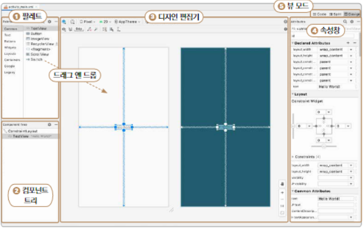

# layout

[TOC]


## 레이아웃 에디터

- MainActivity.kt 레이아웃 파일 지정

  - oncreate()안에 setContentView() 함수에 지정

  - ```kotlin
    class MainActivity : AppCompatActivity() {
        override fun onCreate(savedInstanceState: Bundle?) {
            super.onCreate(savedInstanceState)
            setContentView(R.layout.activity_main)
        }
    }
    ```

  

- 팔레트

  - 레이아웃으로 드래그 앤 드롭할수 있는 뷰와 레이아웃

- 컴포넌트 트리

  - 레이아웃 계층 구조

- 디자인 편집기

  - 도화지 같은 곳

- 속성창

  - 선택한 뷰의 여러 속성을 제어

- 뷰모드

  - code 
  - split - 코드와 디자인 모드 동시에 보여줌 
  - design

## XML

>- Extensible Markup Language
>
>- 많은 종류의 데이터를 저장하고 관리할 목적
>
>- 데이터를 구조화하여 쉽게 표현할 수 있어서 많이 사용함
>
>- 태그(파란색), 요소(보라색), 값(초록색)으로 구성 [색깔은 기본 설정]
>
>  ```kotlin
>  <TextView android:text = "Hello World!" />
>     태그   요소(네임스페이스:속성)   값
>  ```


```kotlin
<?xml version="1.0" encoding="utf-8"?>
```

- 메타 데이터를 알려주는 데 사용
- 버전과 인코딩 방식


