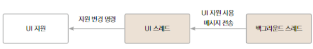

# 스레드

[TOC]

## 메인 스레드 & 백그라운드 스레드

- 메인 스레드
  - UI스레드라고도 불림
  - 앱이 처음 시작될 때 시스템이 스레드 하나를 생성하고 이것을 메인 스레드라고 한다.
  - 역할
    - 액티비티의 모든 생명 주기 관련 콜백 실행을 담당
    - 버튼, 에디트텍스트와 같은 UI 위젯을 사용한 사용자 이벤트와 UI드로잉 이벤트 담당

- 백그라운드 스레드
  - 워커스레드라고도 불림
  - 작업량이 큰 연산이나, 네트워크 통신, 데이터베이스 쿼리 등 처리에 긴 시간이 걸리는 작업을 하는 곳
  - UI관련 작업은 백그라운드에서 하면 안됨
  - UI 자원을 사용하려면 메인 스레드에 UI 자원 사용 메세지를 전달하는 방법을 이용
  - 
    - UI스레드에서 UI작업을 하는데 Handler class, AsyncTask class, runOnUiThread() method등 활용

- runOnUiThread() method
  - UI 스레드에서 코드를 실행시킬 때 쓰는 activity class의 method

​        

