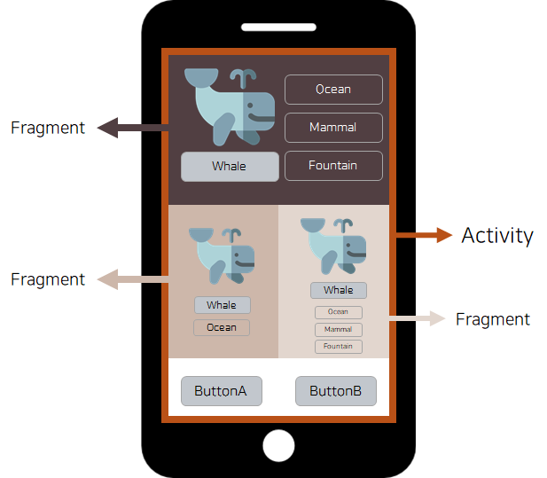

# 프로젝트 구조


[TOC]

## 프로젝트 구조 알아보기

### App 폴더

- 소스코드

```
app
├── manifests
├── java
└── res(resource)
|   ├── drawable
|   ├── layout
|   ├── mipmap
|   ├── values
|   └── xml
```

- drawable
  - 앱 내 사용할 이미지 파일들
  - new - vector asset
- layout
  - activity와 fragment 같은 화면에 보여줄 화면을 xml파일로 저장하는 곳
- minmap
  - app lancher에 등록할 아이콘 파일
- values
  - color, string을 저장하는 곳
    - key, value 값으로 되어 있음
  - themes
    - 안드로이드 app에서 테마를 정하는 곳
    - colorPrimary 메인이 되는 컬러
    - themes파일이 2개 있는 이유 다크모드와 라이트모드 지원하기 때문

- Gradle Scripts 폴더
  - 빌드에 필요한 정보

```
Gradle Scripts
├── build.gradle (project)
├── build.gradle (module)
├── gradle-wrapper.properties
├── proguard-rules.pro
├── gradle.properties
├── settings.gradle
└── local.properties
```

- build.gradle (project)
  - module보다 큰 scope 설정의 관여 함

```gradle
plugins {
    id 'com.android.application' version '7.3.1' apply false
    id 'com.android.library' version '7.3.1' apply false
    id 'org.jetbrains.kotlin.android' version '1.7.20' apply false
}

task clean(type: Delete) {
	delete rootProject.buildDir
}
```

- plugin - 프로젝트를 빌드하는데 필요한 라이브러리
- apply - 모든 모듈에 적용할 것인지 여부
- module에 있는 plugin에 제시해준 부분만 적용
- task clean - 빌드할 때 기존 파일들을 어떻게 할 것인가
  - delete - 빌드한 파일들을 다 삭제하고 리빌딩

- settings.gradle
  - build.gradle (project) 보다 더 높은 scope

```
pluginManagement {
    repositories {
        gradlePluginPortal()
        google()
        mavenCentral()
    }
}
```

- pluginManagement
  - repositories - build(project)에서 import한 plugin들의 소스들 어디서 가져올지 설정해주는 곳


- build.gradle (module)

  - compileSdk - 모듈이 컴파일하는 API 레벨

  - defaultConfig - 빌드 타입과 무관하게 빌드 시 모두 적용되는 속성

    - minSdk - 앱을 사용할 수 있는 최소한의 API 레벨

    - targetSdk - 앱이 기기에서 동작할 때 사용하는 API 레벨(앱이 개발시에 테스트 되어진 API레벨)

      ex) 기기 버전 API 28이고, targetSdk이 API 24이면 앱은 API24를 기본으로 동작

      **앱 개발 당시의 최신 API를 타겟 sdk로 지정할 것을 권장**

  - buildtype

    - release - 출시할 때 사용하는 모드
    - config - 개발할 때 사용하는 모드

- compileOptions - 컴파일 할 때 필요한 옵션들 지정
- kotlinOptions - jvmtarget version을 지정
- dependencies (개발 시 가장 많이 수정할 곳)
  - 아래 나와 있는 라이브러리들이 종속되어 있다
  - 필수적인 구성 요소
  - 필요한 라이브러리들을 가져와서 쓰면 된다.


### 토막 상식

- Gradle이란?
  - 빌드 프로세스 자동화 툴
  - 작성한 코드를 컴파일, 테스트, 서명 및 배포, apk, bundle 패키징을 위한 것

- 프로젝트와 모듈의 차이점

- minSdk, targetSdk, compileSdk

```
- compileSdk - 어떤 안드로이드 SDK 버전으로 앱을 컴파일 할 것인지
	**앱 개발 당시의 최신 API 를 컴파일 sdk로 지정할 것을 권장**

- minSdk - 앱을 사용할 수 있는 최소한의 API 레벨
프로젝트 생성 시 설정하는 값
ex) 기기 버전 API 23이고, minSdk API가 26이면 사용 불가능

- targetSdk - 앱이 기기에서 동작할 때 사용하는 API 레벨(앱이 개발시에 테스트 되어진 API레벨)

  ex) 기기 버전 API 28이고, targetSdk이 API 24이면 앱은 API24를 기본으로 동작

  **앱 개발 당시의 최신 API를 타겟 sdk로 지정할 것을 권장**
```

Package name - 식별이 가능한 폴더

Save location - 폴더 저장 위치

MinSdk - 사용할 수 있는 api 범위 지정하는 곳 [기본 값 추천 (강의 기준 API 26)]

activity - 사용자와 앱이 상호작용하는 진입점이고 하나의 화면을 구성하는 것

fragment - Activity 안에서 화면의 일부를 구성하는 것 (Fragment는 또다른 Fragment 내에서도 생성될 수 있다)



- Fragment는 **Activity나 다른 Fragment에** **의해 호스팅**되어야하며, 독립적으로 화면 구성이 가능하고 자체적인 입력 이벤트를 처리할 수 있다.

