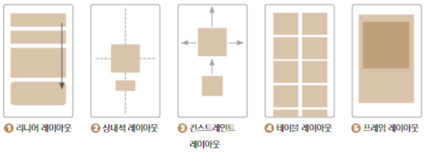
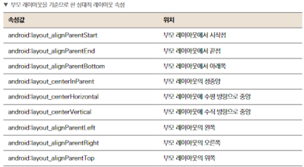
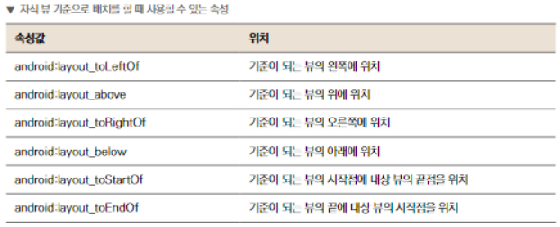
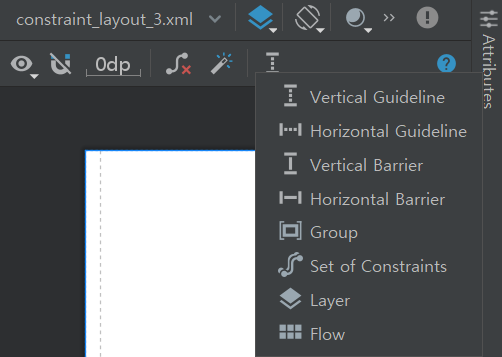

# 화면 구성하기_레이아웃(뷰그룹)

[TOC]

## 종류

- **LinearLayout**
  - 수직 방향 혹은 수평 방향으로 주어진 뷰
- **RelativeLayout**
  - 뷰들이 다른 뷰들로부터 위치를 지정하거나 자신이 속한 레이아웃을 기준으로 위치를 정함
- **ConstraintLayout**
  - 뷰 사이에 수평, 수직 방향의 제약을 주어 뷰들을 위치시킴
- **TableLayout**
  - 뷰를 행과 열로 구성하여 표의 형태로 표현
- **FrameLayout**
  - 액자처럼 구성
  - 나중에 추가한 뷰가 가장 위에 위치하도록 하는 형태
  - 화면에 표시될 하나의 뷰를 바꿔가며 표시하는데 적합

## LinearLayout

- 가로 or 세로 방향 직선 모양으로 정렬
- 뷰가 쌓이는 순서가 중요함
- 방향 속성을 꼭 지정 해줘야 함
  - `android:orientation="horizontal"`
  - vertical - 세로 방향 (수직)
  - horizontal - 가로 방향 (수평)
  - orientation은 레이아웃 속성 자체에 값을 주어 종속된 모든 뷰가 영향 받는다
- layout_gravity
  - `android:layout_gravity="center"`
  - 독립적으로 위치를 지정하는 속성
  - vertical - start / center / end
  - horizontal - top / center / bottom
- layout_weight
  - 비중을 지정하는 속성
  - weightSum = layout_weight의 합

>cf) Tip
>
>- 각 버튼의 속성에 더 이상 크기를 명시적으로 지정해주지 않으면 0dp라고 작성
>- 레이아웃에서 뷰가 정해진 고정 값이 아닌 경우에는 0dp

## RelativeLayout

- 다른 뷰를 기준으로 상대적 위치를 지정하는 레이아웃
- 리니어 레이아웃을 사용할 때보다 조금 더 복잡한 레이아웃 구성을 목표로 할 때 적합

>cf) Tip
>
>- `\n` 문자열 안에 사용하면 줄 바꿈
>- `\t` 탭을 누른 것처럼 띄어쓰기 해줌

- 자식 뷰끼리 배치
- 
- 서로 간의 위치에 영향을 주지 않고 오로지 부모 레이아웃을 기준으로 배치

## ConstraintLayout

- 화면을 구성하는 뷰들에게 서로 제약을 준다
- 반응형 UI를 쉽게 구성할 수 있어서 자주 사용한다
- 중첩된 레이아웃을 사용하지 않고도 크고 복잡한 레이아웃을 만들 수 있어 성능면에서 유리
- 자식 뷰의 위치를 정의하려면 자식 뷰의 수직/수평 방향에 대한 제약 조건을 하나 이상 추가해야 함
- 자식 뷰에 아무런 제약도 추가해주지 않으면 왼쪽 상단에 배치됨
- `app:layout_constraint[내 방향]_to[기준 뷰 방향]of = "[기준 뷰 ID or parent]"`
- constraintLayout margin줄 때 해당 방향에 제약을 주고 margin값을 줘야 적용됨
- match_constraint( == 0dp)는 제약에 뷰 크기를 맞추는 것

## 반응형 UI

- 

- 가이드 라인 3가지 제약 종류
  - `app:layout_constraintGuide_begin = "xdp"`
    - 부모 레이아웃의 시작점을 기준으로 xdp만큼 떨어진 가이드라인
  - `app:layout_constraintGuide_end = "xdp"`
    - 부모 레이아웃의 끝점을 기준으로 xdp만큼 떨어진 가이드라인
  - `app:layout_constraintGuide_percent = "0.x"`
    - 수평방향 가이드라인이면 위쪽, 수직 방향 가이드라인이면 왼쪽 기준으로 몇 퍼센트 지점에 위치하는지를 정함
    - 0.3 -> 전체 길이의 30% 지점에 가이드라인이 위치