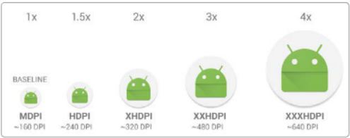
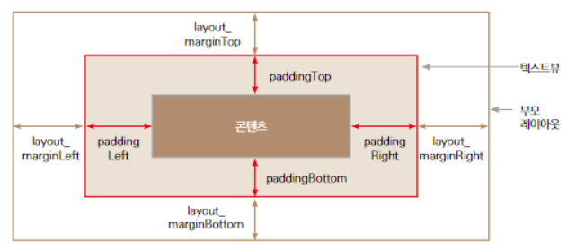
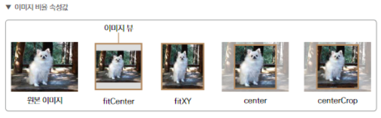

# 화면 구성하기, 뷰(위젯)

[TOC]

## 뷰(위젯) 

- layout_width - 뷰의 너비

- layout_height - 뷰의 높이

  - match_parent : 해당 뷰를 담고 있는 부모 레이아웃의 크기에 맞춤
  - wrap_content : 해당 뷰 안에 들어있는 내용에 크기를 자동으로 맞춤
  - 직접 지정 : ex) 100dp, 200dp

  >dp란?
  >
  >density-independent pixel의 줄인 말
  >
  >해상도가 변해도 같은 크기를 보여주기 위한 단위
  >
  >

  

  

## padding & margin

- padding 과 margin

- 

- left/right vs start/end 차이
  - 모든 언어에서 글이 왼쪽에서 시작하지 않기 때문
  - LTR인 한국어와 영어, RTL인 아랍어
  - LTR, RTL 미러링 기능을 지원하는 start-end 형식을 쓰는 것을 권장

## 텍스트뷰

- text - 텍스트뷰에서 보여 줄 글자
- textColor - 텍스트 색깔 [#000000]
- textSize - 텍스트 크기 [sp/dp]
- textStyle - 텍스트 스타일 [기본/italic/bold]

>dp와 sp의 차이점
>
>dp - 해상도에 상관없이 동일한 크기로 뷰를 보여주기 위한 단위
>
>sp - (scale-independent pixcels) 텍스트 크기를 지정하는 단위
>
>​		- 휴대폰 설정에 있는 시스템 글자 크기를 변경하면 확인 가능

- strings.xml / colors.xml
  - 유지보수에 용이하기 위해서 컬러와 텍스트를 분리시켜 관리함

## 이미지 뷰

- 화면에 이미지를 출력 해주는 뷰
- drawable 폴더에 저장해서 src로 파일 불러오기 (drawable-24폴더에 저장)
- 이미지 뷰 비율 조정(scale type)
- 
  - fitCenter
    - scaleType 속성의 기본값으로서, 가로 또는 세로 중 한 방향으로 스케일 됨
    - 이미지뷰의 센터를 기준으로 이미지가 표시
    - 기본 값
  - fitXY
    - 가로, 세로 방향으로 이미지가 이미지뷰를 빈틈없이 채움
  - center
    - 스케일 없이 이미지를 가운데 표시
    - 이미지가 뷰보다 크면 자르고, 작으면 작은대로 표시
  - centerCrop
    - 이미지 비율은 그대로 유지한 상태로 스케일
    - 이미지뷰를 벗어나는 부분은 잘라낸 채로 보여줌

## Button

- 레이아웃의 전환이나 사용자와 앱이 상호작용을 하는 데 사용하는 뷰
- 사용자의 행동을 유도하는 용도
- 텍스트뷰를 상속하고 있기 때문에 텍스트뷰에서 사용하는 속성과 기능을 그대로 사용 가능

## 에디트텍스트

- 로그인할 때 이메일과 비밀번호 입력했던 뷰
- 텍스트뷰를 상속하고 있어서 텍스트뷰의 속성과 기능 사용 가능
- 속성
  - textpassword - 비밀번호를 입력한 값 대신 *로 보여줌
  - phone - 전화번호를 입력하는 속성
  - textemailaddress - 이메일을 입력받는 속성
  - datetime - 날짜와 시간 형식의 값을 받는 속성