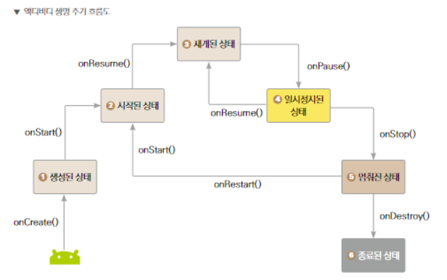
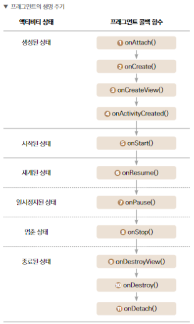

# 화면 제어하기

[TOC]

## 안드로이드 4대 구성요소

- **activity** - 사용자에게 사용자 인터페이스를 제공
- **service** - 백그라운드 조작을 수행
- **broadcast receiver** - 앱의 밖에서 일어난 이벤트를 앱에 전달
- **content provider** - 데이터를 관리하고 다른 앱의 데이터를 사용할 수 있게 함

## Activity

- 화면의 기본 구성 단위
- 만든 UI를 보여주고, 터치, 드래그, 키보드 입력과 같은 여러 상호작용을 제공
- UI는 xml파일, 동작은 kt파일로 구성

### Activity 생명 주기

- activity가 생성되고 종료되기 까지를 생명 주기라고 부른다.

- 각 상태에 진입하려면 그에 맞는 콜백 함수가 호출되어야 함
- 종료된 상태의 activity는 다시 상태 변환을 할 수 없다
- activity는 생성부터 소멸까지 각각의 상태를 거치며 그때 수행할 수 있는 일이 있다.

- onCreate()
  - 생성된 상태
  - activity에 필요한 초기 설정
  - 보여 줄 레이아웃을 선택

- setContentView()
  - 사용자에게 보여 줄 레이아웃을 지정
  - 레이아웃을 정의한 파일의 ID를 인수로 전달

- 생성된 상태가 되려면 화면이 있어야 하고, 화면이 있으려면 사용할 레이아웃이 뭔지 알아야 한다.
-  특정 뷰가 사용자와의 상호작용하기 시작하면 해당 뷰에 '포커스가 있다'라고 표현함

- onCreate()
  - activity가 처음 시작할 때 실행
  - 레이아웃 지정, 클래스 범위 변수 초기화 등 기본적인 시작 로직 구현
- onStart()
  - activity가 시작된 상태 들어가기 직전에 실행
  - activity가 사용자에게 보이지만 상호작용은 준비하는 단계
  - UI 관련 로직을 초기화하는 코드를 작성
- onResume()
  - activity가 재개된 상태로 들어가기 직전에 실행
  - activity와 사용자의 상호작용이 가능
  - 전화 및 다른 activity로 이동 등 포커스를 잃기 전까진 activity는 재개된 상태로 존재
- onPause()
  - 사용자가 activity를 떠나는 경우 처음 실행되는 콜백 함수
  - activity에 포커스가 없다
  - 더 이상 실행할 필요가 없는 부분들을 비활성화 하면 됨
  - 지속 시간이 짧아 중요하거나 시간이 오래 걸리는 작업은 수행하면 안됨
- onStop()
  - activity가 사용자에게 더 이상 표시 안되는 중단된 상태에 들어가기 직전에 실행되는 콜백
  - DB에 정보를 저장, 네트워크 호출 같은 부하가 큰 작업을 수행함
- onDestroy()
  - activity가 완전히 소멸되기 직전에 호출되는 함수

### Activity간의 화면 전환

> intent - 무엇을 하고 싶은지 의지를 나타내는 것
>
> ex) A activity에서 B activity로 넘어가고 싶을 때 intent 객체를 사용하면 된다. intent 객체를 사용하면 activity뿐만 아니라 안드로이드 4대 구성 요소를 자유롭게 넘나 들 수 있음
>
> - intent 객체가 사용자의 다양한 요청을 알맞은 구성 요소에게 보내 주는 것

- activity(or fragment)전환

## Fragment

- activity 안에서 일정 부분을 차지하는 것
- activity안에서 여러 fragment를 보여 줄 수 있고, 같은 fragment를 여러 activity에서 재 사용 가능
- fragment는 activity와 하는 일은 비슷하지만 하위 개념이며 activity위에 뗏다 붙였다 할 수 있는 것

- 특징
  - activity 안에 종속되어 있어야 한다
  - activity의 생명 주기에 영향을 받지만, fragment 고유의 생명 주기가 존재
  - activity가 실행 중일 때 fragment를 추가하거나 제거 가능
- 분할된 화면을 독립적으로 활용하고 재 사용

### Fragment 생명 주기

cf) host activity - fragment가 속한 activity를 부르는 말

- onAttach()
  - fragment가 host activity에 더해지고 나서 호출 되는 함수
- onCreate()
  - fragment가 최초로 생성된 시점에 호출되는 함수
  - fragment를 초기화하는 코드가 들어감
- onCreateView()
  - fragment에서 굉장히 중요한 콜백 함수
  - fragment에 그릴 view를 생성할 때 호출되는 함수
- onActivityCreated()
  - activity의 onCreate() 함수가 완료되고 나서 실행되는 함수
  - activity 생성 후에 fragment에서 해주어야 할 작업을 하는 곳
  - activity와 fragment의 view가 생성된 후여서 view를 변경 가능
- onStart()
  - 사용자에게 fragment가 보이기 시작할 때 실행
- onResume()
  - 사용자와 상호작용할 수 있는 곳
  - 사용자가 fragment를 떠나지 않는 이상 계속 재개된 상태
- onPause()
  - 사용자가 fragment를 떠날 때 처음 불러지는 콜백 함수
  - 불필요한 리소스들을 해제하는 곳
- onStop()
  - fragment가 사용자에게 더 이상 보이지 않을 때 호출되는 콜백 함수
- onDestroyView()
  - onCreateView()와 상응되는 함수로서 뷰 리소스들을 해체하는 곳
- onDestroy()
  - fragment가 마지막으로 완전히 삭제되기 전에 호출되는 함수
- onDetach()
  - onAttach() 콜백 함수와 상응되는 것으로 activity와의 연결 끊기 전에 호출되는 함수

### Fragment 화면 전환

- activity안에서 자유롭게 추가되거나 제거될 수 있다.
- 프래그먼트 트랜잭션을 사용하면 프래그먼트 추가, 삭제 혹은 기존 프래그먼트와 교체하고 백스택에 추가하는게 가능하다.
- 백스택 - 스택과 같이 태스크들이 쌓여있는 형태

